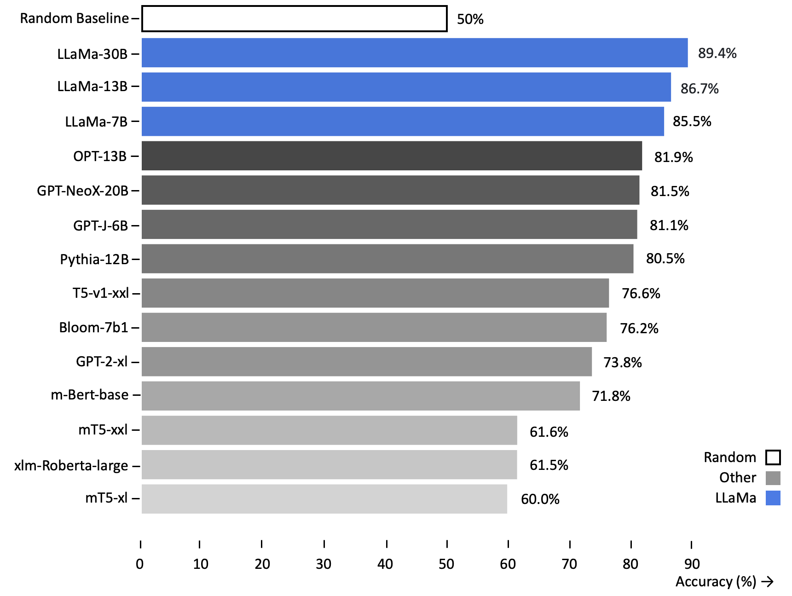

# Polyglot or Not?: Measuring Multilingual Encyclopedic Knowledge Retrieval from Foundation Language Models

[](https://github.com/daniel-furman/Capstone/blob/main/LICENSE) 
[](https://www.python.org/downloads/release/python-390/) 
[](https://github.com/psf/black) 

This is the repository for [Polyglot or Not?: Measuring Multilingual Encyclopedic Knowledge Retrieval from Foundation Language Models](https://bit.ly/ischool-berkeley-capstone). It contains several research artifacts, including:

1. The main [code][cka_run_main] for running the fact-completion test
2. The [data][hf_data] used for the test, which contains 20 languages
3. A lightweight [demo][cka_lightweight_demo] for contrastive knowledge assessment

## Test Description

Given a factual association such as *The capital of France is **Paris***, we determine whether a model adequately "knows" this information with the following test:
 
* Step **1**: prompt the model to predict the likelihood of the token **Paris** following *The Capital of France is*
* Step **2**: prompt the model to predict the average likelihood of a set of false, counterfactual tokens following the same stem.
 
If the value from **1** is greater than the value from **2** we conclude that model adequately recalls that fact. Formally, this is an application of the Contrastive Knowledge Assessment proposed in [[1][bib]]. For every foundation model of interest (like [LLaMa](https://arxiv.org/abs/2302.13971)), we perform this assessment on a set of facts translated into 20 languages. All told, we score foundation models on 303k fact-completions ([results](https://github.com/daniel-furman/capstone#multilingual-fact-completion-results)). We also score monolingual models (like [GPT-2](https://d4mucfpksywv.cloudfront.net/better-language-models/language_models_are_unsupervised_multitask_learners.pdf)) on English-only fact-completion ([results](https://github.com/daniel-furman/capstone#english-fact-completion-results)).

## Data Release

We present [`CalibraGPT/Fact-Completion.parquet`][hf_data], a fact completion dataset with 303k fact-counterfact pairs in total. The dataset covers 20 languages, which use either the Latin or Cyrillic scripts: bg, ca, cs, da, de, en, es, fr, hr, hu, it, nl, pl, pt, ro, ru, sl, sr, sv, uk. The English cut of the dataset was sourced from [[1][bib]] and [[2][bib]]. We used the Google Translate API to generate the other 19 language cuts.

## Test Results

**NB**: The bolded values indicate the overall percentage of fact completions adequately retrieved by the model. The uncertainty estimates (+/-) represent 95% confidence intervals computed from 10000 bootstrap iterations.

### **Multilingual** fact-completion results.

<center>

| Model            | 20 Languages<br />(avg % correct)      | Num Params | Authors      |  Org   |
|------------------|:--------------:|:--------------:|--------------|--------------|
| [llama-30b](https://arxiv.org/abs/2302.13971) | **79.31** +/- 0.74 | 30B | Touvron et al., 2023 | Meta | 
| [m-bert-base](https://arxiv.org/abs/1810.04805) |  **62.00** +/- 0.87 | 110M | Devlin et al., 2018 | Google |
| [bloom-7b1](https://arxiv.org/abs/2211.05100) | **57.70** +/- 0.88 | 7B | Scao et al., 2022 | BigScience |
| [xlm-roberta-large](https://arxiv.org/abs/1911.02116) | **56.03** +/- 0.90 | 355M | Conneau et al., 2019 | Meta | 
| [mt5-xl](https://arxiv.org/abs/2010.11934) |  **coming** +/- coming | 3.7B | Xue et al., 2020 | Google |
| Random Baseline | 50 | &nbsp;| &nbsp; | &nbsp; |

</center>

&nbsp;

### **English** fact-completion results.



<center>

| Model            | English-only<br />(% correct)      | Num Params | Authors    |  Org   | 
|------------------|:--------------:|:--------------:|--------------|--------------|
| [llama-30b](https://arxiv.org/abs/2302.13971) | **89.40** +/- 0.38 |  30B |  Touvron et al., 2023 | Meta |
| [llama-13b](https://arxiv.org/abs/2302.13971) | **86.66** +/- 0.42 |  13B |  Touvron et al., 2023 | Meta |
| [llama-7b](https://arxiv.org/abs/2302.13971) | **85.53** +/- 0.43 |  7B |  Touvron et al., 2023 | Meta |
| [opt-13b](https://arxiv.org/abs/2205.01068) | **81.94** +/- 0.46 | 13B |  Zhang et al., 2022 | Meta |
| [gpt-neox-20b](https://arxiv.org/abs/2204.06745) | **81.50** +/- 0.47 | 20B |  Black et al., 2022 | EleutherAI |
| [gpt-j-6b](https://github.com/kingoflolz/mesh-transformer-jax/#gpt-j-6B) |  **81.14** +/- 0.47 |  6B | Wang et al., 2021 | EleutherAI |
| [pythia-12b](https://arxiv.org/abs/2304.01373) | **80.53** +/- 0.48 | 12B | Biderman et al., 2023 | EleutherAI|
| [t5-v1-xxl](https://arxiv.org/abs/1910.10683) | **76.55** +/- 0.52 | 11B |  Raffel et al., 2019 | Google |
| [bloom-7b1](https://arxiv.org/abs/2211.05100) | **76.16** +/- 0.51 |  7B |  Scao et al., 2022 | BigScience |
| [gpt2-xl](https://d4mucfpksywv.cloudfront.net/better-language-models/language_models_are_unsupervised_multitask_learners.pdf) | **73.76** +/- 0.54 | 1.5B |  Radford et al., 2018 | OpenAI |
| [m-bert-base](https://arxiv.org/abs/1810.04805) | **71.80** +/- 0.55 | 110M | Devlin et al., 2018 | Google | 
| [mt5-xxl](https://arxiv.org/abs/2010.11934) | **61.58** +/- 0.59|  11B |  Xue et al., 2020 | Google |
| [xlm-roberta-large](https://arxiv.org/abs/1911.02116) | **61.55** +/- 0.59 | 355M | Conneau et al., 2019 | Meta |
| [mt5-xl](https://arxiv.org/abs/2010.11934) |  **59.96** +/- 0.59 | 3.7B |  Xue et al., 2020 | Google |
| Random Baseline | 50   | &nbsp; | &nbsp; | &nbsp; |  

</center>


&nbsp;

### **LLaMa** fact-completion results across all 20 languages. 


&nbsp;

## Authors

* Daniel Furman <daniel_furman@berkeley.edu>
* Tim Schott <timschott@berkeley.edu>
* Shreshta Bhat <bhat_shreshta@berkeley.edu>

## Advisor

* David Bamman <dbamman@berkeley.edu>

## Citation

Please cite this repository as follows if you use its data or code:

```
@misc{polyglot_or_not,
  author = {Daniel Furman and Tim Schott and Shreshta Bhat},
  title = {Polyglot or Not?: Measuring Multilingual Encyclopedic Knowledge Retrieval from Foundation Language Models},
  year = {2023}
  publisher = {GitHub},
  howpublished = {\url{https://github.com/daniel-furman/Capstone}},
}
```

## Bibliography 

[1] Dong, Qingxiu, Damai Dai, Yifan Song, Jingjing Xu, Zhifang Sui, and Lei Li. "Calibrating Factual Knowledge in Pretrained Language Models". In Findings of the Association for Computational Linguistics: EMNLP 2022. [arXiv:2210.03329][cka] (2022).

[2] Meng, Kevin, Arnab Sen Sharma, Alex Andonian, Yonatan Belinkov, and David Bau. "Mass Editing Memory in a Transformer." arXiv preprint [arXiv:2210.07229][memit] (2022).

[3] ElSahar, Hady, Pavlos Vougiouklis, Arslen Remaci, Christophe Gravier, Jonathon S. Hare, Frédérique Laforest and Elena Paslaru Bontas Simperl. “T-REx: A Large Scale Alignment of Natural Language with Knowledge Base Triples.” International Conference on Language Resources and Evaluation. [Link][trex] (2018).


[bib]: https://github.com/daniel-furman/Capstone#bibliography
[hf_data]: https://huggingface.co/datasets/CalibraGPT/Fact-Completion
[cka]: https://arxiv.org/abs/2210.03329
[memit]: https://arxiv.org/abs/2210.07229
[mmlu]: https://paperswithcode.com/sota/multi-task-language-understanding-on-mmlu
[mmlu_paper]: https://arxiv.org/abs/2009.03300
[trex]: http://aclanthology.lst.uni-saarland.de/L18-1544.pdf
[cka_lightweight_demo]: https://github.com/daniel-furman/Capstone/blob/main/notebooks/fact_completion_notebooks/fact-completion-lightweight-demo.ipynb
[cka_run_main]: https://github.com/daniel-furman/Capstone/blob/main/notebooks/fact_completion_notebooks/fact-completion-full-benchmark.ipynb
