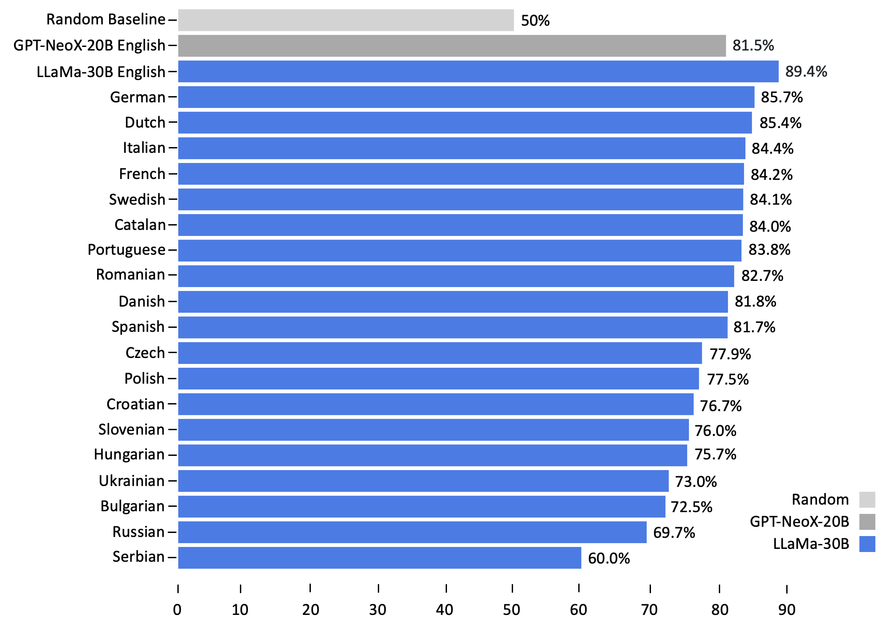

# Polyglot or Not?: Measuring Multilingual Encyclopedic Knowledge Retrieval from Foundation Language Models

[](https://github.com/daniel-furman/Capstone/blob/main/LICENSE) 
[](https://www.python.org/downloads/release/python-390/) 
[](https://github.com/psf/black) 

This is the repository for [Polyglot or Not?: Measuring Multilingual Encyclopedic Knowledge Retrieval from Foundation Language Models](https://bit.ly/ischool-berkeley-capstone). It contains several research artifacts, including:

1. The main [code][cka_run_main] for running the "Polyglot or Not?" fact-completion test
2. The [data][hf_data] used for the test, which contains 20 languages
3. A lightweight [demo][cka_lightweight_demo] for running fact-completion tests via contrastive knowledge assessment

## Abstract

Can foundation language models be used as multilingual knowledge bases? We propose a new test to measure a text model’s fact completion accuracy across different languages. To attain high accuracy on this test, models must possess extensive encyclopedic knowledge across a wide range of topics. Our experiments uncover important differences in the accuracy of various foundation models when working with translated counterfactuals. Ultimately, we find that the promise of utilizing foundation language models as bonafide polyglots is greatly diminished when they are tasked with retrieving information in languages other than English. 

## Data Release

[`Fact-Completion.parquet`][hf_data] contains 303k fact-completions used for the "Polyglot or Not?" test. The dataset includes 20 languages based in Latin or Cyrillic script. We sourced the English cut of the dataset from [[1][bib]] and [[2][bib]] and used the Google Translate API to produce the other 19 language cuts.

## Test Leaderboards

To add a new model to the leaderboard, please reach out to us or submit a pull request.

| Language            | Authors     |  20 Language Average (%)       |
|------------------|--------------|:--------------:|
| [llama-30b](https://arxiv.org/abs/2302.13971) | Touvron et al., 2023 | **79.31** +/- 0.74| 
| [bloom-7b1](https://arxiv.org/abs/2211.05100) | Scao et al., 2022 | (forthcoming) | 
| [m-bert-base](https://arxiv.org/abs/1810.04805) | Devlin et al., 2018 | (forthcoming) | 
| [xlm-roberta-large](https://arxiv.org/abs/1911.02116) | Conneau et al., 2019 | (forthcoming) | 
| Random guessing | N/A | 50 | 

Table 1: **Multilingual** results.

| Model            | Authors      | English (%)      |
|------------------|--------------|:--------------:|
| [llama-30b](https://arxiv.org/abs/2302.13971) | Touvron et al., 2023 | **89.40** +/- 0.38 | 
| [gpt-neox-20b](https://arxiv.org/abs/2204.06745) | Black et al., 2022 | **81.50** +/- 0.47 |
| [gpt-j-6b](https://github.com/kingoflolz/mesh-transformer-jax/#gpt-j-6b) | Wang et al., 2021 | **81.14** +/- 0.47 |
| [flan-t5-xxl](https://arxiv.org/abs/2210.11416) | Chung et al., 2022 | **78.17** +/- 0.51 | 
| [bloom-7b1](https://arxiv.org/abs/2211.05100) | Scao et al., 2022 | **76.16** +/- 0.51 | 
| [gpt2-xl](https://d4mucfpksywv.cloudfront.net/better-language-models/language_models_are_unsupervised_multitask_learners.pdf) | Radford et al., 2018 | **73.76** +/- 0.54 | 
| [m-bert-base](https://arxiv.org/abs/1810.04805) | Devlin et al., 2018 | **71.80** +/- 0.55 | 
| [xlm-roberta-large](https://arxiv.org/abs/1911.02116) | Conneau et al., 2019 | **61.55** +/- 0.59 | 
| Random guessing | N/A | 50   |  

Table 2: **English** results.



Figure 1: **LLaMa** results. 


The above results compare the percentage of factual statements that the language model completed correctly. A correct fact completion indicates the given model predicted the true word token with a greater probability than the false token(s). The uncertainty estimates (+/-) represent 95% confidence intervals computed from 10000 bootstrap iterations.

## Authors

* Daniel Furman <daniel_furman@berkeley.edu>
* Tim Schott <timschott@berkeley.edu>
* Shreshta Bhat <bhat_shreshta@berkeley.edu>

## Advisor

* David Bamman <dbamman@berkeley.edu>

## Citation

Please cite this repository as follows if you use its data or code:

```
@misc{polyglot_or_not,
  author = {Daniel Furman and Tim Schott and Shreshta Bhat},
  title = {Polyglot or Not?: Measuring Multilingual Encyclopedic Knowledge Retrieval from Foundation Language Models},
  year = {2023}
  publisher = {GitHub},
  howpublished = {\url{https://github.com/daniel-furman/Capstone}},
}
```

## Bibliography 

[1] Dong, Qingxiu, Damai Dai, Yifan Song, Jingjing Xu, Zhifang Sui, and Lei Li. "Calibrating Factual Knowledge in Pretrained Language Models". In Findings of the Association for Computational Linguistics: EMNLP 2022. [arXiv:2210.03329][cka] (2022).

[2] Meng, Kevin, Arnab Sen Sharma, Alex Andonian, Yonatan Belinkov, and David Bau. "Mass Editing Memory in a Transformer." arXiv preprint [arXiv:2210.07229][memit] (2022).

[3] ElSahar, Hady, Pavlos Vougiouklis, Arslen Remaci, Christophe Gravier, Jonathon S. Hare, Frédérique Laforest and Elena Paslaru Bontas Simperl. “T-REx: A Large Scale Alignment of Natural Language with Knowledge Base Triples.” International Conference on Language Resources and Evaluation. [Link][trex] (2018).


[bib]: https://github.com/daniel-furman/Capstone#bibliography
[hf_data]: https://huggingface.co/datasets/CalibraGPT/Fact-Completion
[cka]: https://arxiv.org/abs/2210.03329
[memit]: https://arxiv.org/abs/2210.07229
[mmlu]: https://paperswithcode.com/sota/multi-task-language-understanding-on-mmlu
[mmlu_paper]: https://arxiv.org/abs/2009.03300
[trex]: http://aclanthology.lst.uni-saarland.de/L18-1544.pdf
[cka_lightweight_demo]: https://github.com/daniel-furman/Capstone/blob/main/notebooks/fact_completion_notebooks/fact-completion-lightweight-demo.ipynb
[cka_run_main]: https://github.com/daniel-furman/Capstone/blob/main/notebooks/fact_completion_notebooks/fact-completion-full-benchmark.ipynb
